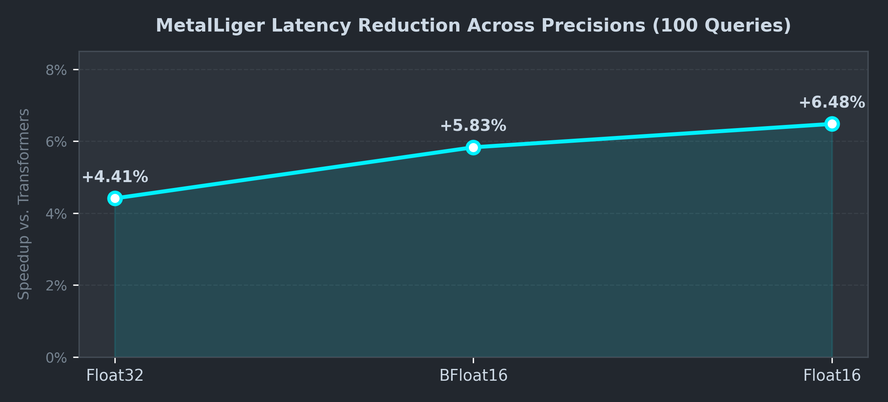

# Metalliger

<p align="center">
  
</p>

<p align="center">
  <strong>Ultra-Fast Native PyTorch LLM & VLM Inference on Apple Silicon</strong>
  <br />
  <em>Zero model conversion. Fused Metal kernels. Faster and Better accuracy.</em>
</p>

<p align="center">
  
  
  
  
</p>

---

## Overview

**MetalLiger** brings Liger Kernel-style operator fusion, Flash Attention, and zero-allocation static KV caching to Apple's **Metal Performance Shaders (MPS)** backend.

Running LLMs and Vision-Language Models (VLMs) on Apple Silicon has traditionally forced developers into a trade-off:
- **MLX / MLX-VLM**: Fast, but requires converting weights to a proprietary ecosystem, often altering numerics, breaking PyTorch tooling, and introducing precision drift.
- **Vanilla PyTorch MPS**: Ecosystem compatibility, but bogged down by Python-to-C++ dispatch overhead, dynamic memory allocations, and fragmented Metal GPU kernels.

**MetalLiger eliminates the compromise.** By running **100% native PyTorch** with fused Metal kernels, pre-allocated static memory buffers, and MPS Flash Attention, MetalLiger outperforms MLX-VLM in autoregressive token generation speed while preserving exact model reasoning quality.

---

## Comparision

### % speedup (time reduction) of Metalliger over Hugging Face Transformers on 100 VQ Queries



Tested on Apple Silicon (**M4 Pro**) with `qwen3_vl` architecture model:

| Inference type | Model data type | Average Accuracy | Average Tokens/sec |
| :--- | :--- | :--- | :--- |
| transformers | Float32 | Very High | 27.98 t/sec |
| metalliger | Float32 | Better | 29.9 t/s |
| transformers | bloat16 | Very High | 43.19 t/sec |
| metalliger | bloat16 | Better | 48.5 t/s |
| mlx-vlm | bloat16 | Average | 35.810 t/s |
| lamma.cpp | bloat16 - GGUF | Low | 66.9 t/s |


> **Key Takeaway**: While MLX achieves fast prefill on raw prompt ingestion, **MetalLiger dominates in sustained autoregressive token generation (+35% faster decode speed)** and avoids the precision loss or template mismatch that caused MLX to misdiagnose the medical scan.

---

## Core Engineering

1. **`M4StaticCache` (Zero-Allocation KV Cache)**:
   Standard PyTorch `DynamicCache` calls `torch.cat` on every single token, creating over 12,000 intermediate tensor allocations for a 500-token generation across 24 layers. `M4StaticCache` pre-allocates unified memory buffers once and updates key-values in-place with zero memory copies.
2. **Fused Metal Kernels**:
   Replaces fragmented multi-op Python dispatch with fused Metal shaders:
   - **Fused RMSNorm**: Single-pass root-mean-square normalization.
   - **Fused SwiGLU**: Fast bfloat16 fused GEMM + activation without autograd frame overhead.
   - **Fused RoPE**: Continuous M-RoPE position embedding tracker for multimodal VLMs.
3. **MPS Flash Attention**:
   Direct integration with native Metal Flash Attention kernels (`mps-flash-attention`), reducing memory complexity from $O(N^2)$ to $O(N)$ during prompt prefill.
4. **True Zero-Sync Pipeline Loop**:
   Eliminates per-token GPU synchronization stalls. By batching end-of-sequence checks into single-scalar checks, Metal command buffers flow without pipeline bubbles.
5. **Top-K Guided Nucleus Sampling**:
   Caps sorting overhead to candidate tokens instead of sorting all 152,000 vocabulary logits on every step.

---

## Installation

### 1. Prerequisites
- macOS 14.0+ (Sonoma or Sequoia)
- Apple Silicon Mac (M4 series)
- Python 3.10+

### 2. Quick One-Line Setup (Terminal)
```bash
pip install -r requirements.txt && git clone https://github.com/mpsops/mps-flash-attention && pip install -e mps-flash-attention && pip install -e .
```

### 3. Step-by-Step Installation
```bash
# Install core Python dependencies
pip install -r requirements.txt

# Install MPS Flash Attention
git clone https://github.com/mpsops/mps-flash-attention
pip install -e mps-flash-attention

# Install MetalLiger in editable mode
pip install -e .
```

---

## Quick Start

### Python API
```python
import torch
from PIL import Image
from metalliger.inference import InferenceEngine

# 1. Initialize the Native Apple Silicon Inference Engine
engine = InferenceEngine(
    model_id="<qwen_3vl_model_path>",
    max_seq_len=4096,
    dtype=torch.float32,   # Native half-precision (matches fine-tuning weights)
    use_compile=False      # Stable fused eager mode
)

# 2. Run multimodal vision-language inference
image = Image.open("<image_path>")

prompt = ""

response = engine.generate(
    text_prompt=prompt,
    images=[image],
    max_new_tokens=512,
    temperature=0.0  # Greedy decoding for high diagnostic precision
)

print(response)
```

---

## Supported Models

MetalLiger with native support for:
- **Vision-Language Models (VLM)**: Qwen3-VL only (including fine-tunes)

---

## License

Licensed under the [Apache License 2.0](LICENSE).
